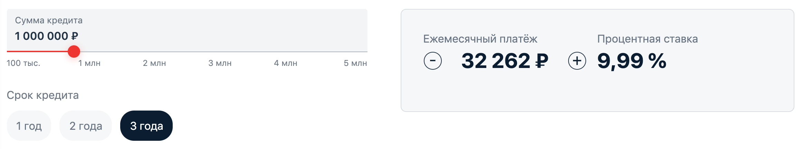

***Практикумы Нетологии по Java***

## Задание

Необходимо написать кредитный калькулятор, который считает как на сайте конкурента, исходя из приведенных примеров по данным:

Нужно провести анализ и написать свой `CreditPaymentService`, который умеет рассчитывать ежемесячный аннуитетный платёж.

**Результат:** [Код программы](https://github.com/SvetlanaKh-1/CreditCalculator/tree/master/src)